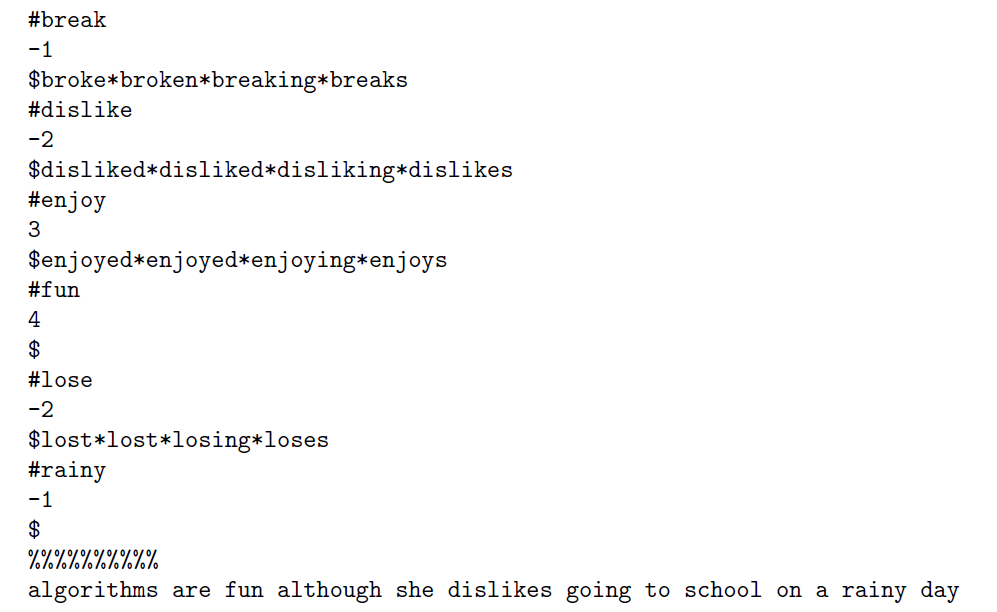

# Sentiment-Analysic
## Introduction
Sentiment analysis is a process to identify opinions in a given piece of text and to determine whether the writer's attitude towards a particular topic (or product, etc.) is positive, negative, or neutral. For example, `fun` has a positive attitude and `dislike` express negative one. In this project, based on the basic knowledge of sentiment score, I will simply sum up the sentiment score to determine the sentiment score of the sentences. 
## Implementation:
Given a sentiment dictionary and a sentence in the following format:

(read the spec for more information about the format)
## Project:
### Stage 1: Read the first word
Create a struct data structure to store the dicitonary. Each struct should contain a word, its sentiment score, and its forms.
### Stage 2: Read the whole dictionary
Apply the same principle of the first stage to the whole dictionary and also return the total number of words, their average number of character and average sentiment score.
### Stage 3: Read the given sentence
Read the setence using linked list data structure and output one word at each line
### Stage 4: Labelling and calculate the sentiment score
Using binary search algorithms to look up for the word in the sentence. If found, return the sentiment score of this word, if not found, the sentiment score will be 0. Then sum up all the the sentiment scores together to find the sentence sentiment scores.
### Stage 5: Handling the Variation Forms
Match the words in the given sentence with dictionary words and their variation forms. If a word in the sentence is matched by a dictionary word or its variation forms, you should output the matched dictionary word (not its variation form) and its sentiment score. If a word cannot be matched, you should output \NOT_FOUND" and a sentiment score of 0.

## Note: 
This project is a university assignment from Foundation of Algorithms subject in The University of Melbourne, Department of Computing and Software System, Semester 1 2019.
